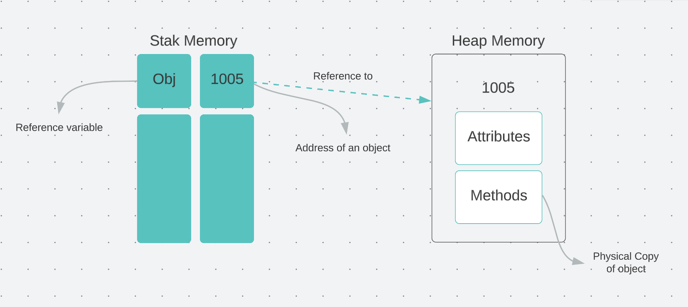

# Memory Allocation
- Java manage 2 areas of memory
	1. Stack
	2. Heap 


- explain from the example
	``` java 
	//Main.java
	public class Main {
			public static void main(String[] args) {
					var textBox1 = new TextBox();
			}
	}
	```
	
	- When java runtime execute `var textBox1 = new TextBox();` first it evaluate right side of assignment operator. 
	- It will create new TextBox object and store it on Heap and assume stored memory address is 8000
	- Then java runtime environment left side from assignment operator and store 8000 on stack part of the memory under textBox1.
		``` java 
			//Main.java
			public class Main {
					public static void main(String[] args) {
							var textBox1 = new TextBox();
							System.out.println(textBox1);
							//memory address- TextBox@1b28cdfa
					}
			}	 
		```
- Referencing 2 variables to the single object.
	``` java 
	public class Main {
			public static void main(String[] args) {
					var textBox1 = new TextBox();
					//textBox1 and textBox2 are references to the same object
					var textBox2 = textBox1;
					textBox2.setText("Hello, World!");
					System.out.println(textBox1.text);//Hello, World!
			}
	}
	```
# Memory deallocation
- When we exit from the method java runtime remove all the stack variables relevant to this method. Now their will be objects without any references in the Heap. Their is process called garbage collection and it will remove those unused objects on the heap.
