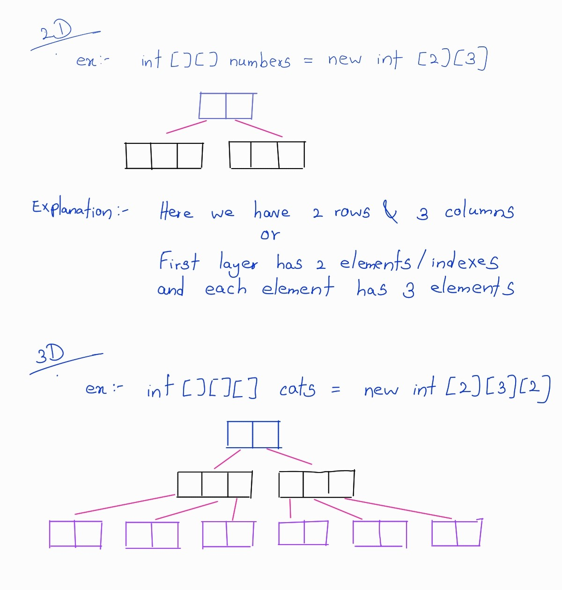

# Arrays
- Use for store list of items(numbers, names,...)
- Array is also a reference type.
- initialization of array(If elements aren't yet defined) and assign values for elements
  ```java
  public class Main {
      public static void main(String[] args) {
          //initialize an array of 5 integers
          //In java array is fixed length
          int[] numbers=new int[5];
          //assigning values only for 1st and 4th elements
          numbers[0]=1;
          numbers[3]=2;
      }
  }
  ```
- If we try to access `number[10]=23` like this we get an exception error
- If we just try to `System.out.println(numbers)` it will print a memory address.
- Printing the string representation of the array
  ```java
  import java.util.Arrays;

  public class Main {
      public static void main(String[] args) {
          int[] numbers=new int[5];
          numbers[0]=1;
          numbers[3]=2;
          System.out.println(Arrays.toString(numbers));//[1,0,0,2,0]
      }
  }
  ```
  
-  Here we can see when we initializing an `int` array by default elements will assign `0` and also for `string` value it will be `null` and for a Boolean array it will be `false` .
  ```java
  import java.util.Arrays;

  public class Main {
      public static void main(String[] args) {
          String[] names=new String[5];
          names[0]="John";
          names[1]="Jane";
          System.out.println(Arrays.toString(names));
          //[John, Jane, null, null, null]
      }
  }
  ```

##  New way to initialize array if we know the elements
``` java
public class Main {
    public static void main(String[] args) {
        int[] numbers = {1, 2, 3, 4, 5};
        System.out.println(Arrays.toString(numbers));//[1, 2, 3, 4, 5]
    }
}
```

- To get the length of array
  `System.out.println(numbers.length);`
## Multi-dimensional Arrays
- As an examples we can use 2 dimensional arrays for matrix and we can use 3 dimensional array for store data of cube
  ``` java 
  public class Main {
      public static void main(String[] args) {
          //Initialize an 2 dimension array which has 2 rows and 3 columns
          int[][] numbers = new int [2][3];
          //Assign values to the first row
          numbers[0][0] = 1;
          numbers[0][1] = 2;
          //use deepToString to print the multidimensional array
          System.out.println(Arrays.deepToString(numbers));
      }
  }
  ```
  
- If we use `Arrays.toString()` methods instead of  `Arrays.deepToString()` we get something like this
  
- Image for explaining multi dimensional array
  
- 3 dimensional array 
  ```java
  import java.util.Arrays;

  public class Main {
      public static void main(String[] args) {
          //Initialize an 2 dimension array which has 2 rows and 3 columns
          int[][][] numbers = new int [2][3][2];
          //Assign values to the first row
          numbers[0][0][1] = 1;
          numbers[0][1][1] = 2;
          //use deepToString to print the multidimensional array
          System.out.println(Arrays.deepToString(numbers));
      }
  }
  ```
  
### Create multidimensional array using `{}`
```java
import java.util.Arrays;

public class Main {
    public static void main(String[] args) {
        //Initialize an 2 dimension array with values using {}
        int[][] numbers = {{1, 2, 3}, {4, 5, 6}};
        //reAssign values
        numbers[0][0] = 3;
        numbers[0][1] = 1;
        //use deepToString to print the multidimensional array
        System.out.println(Arrays.deepToString(numbers));
    }
}
```
